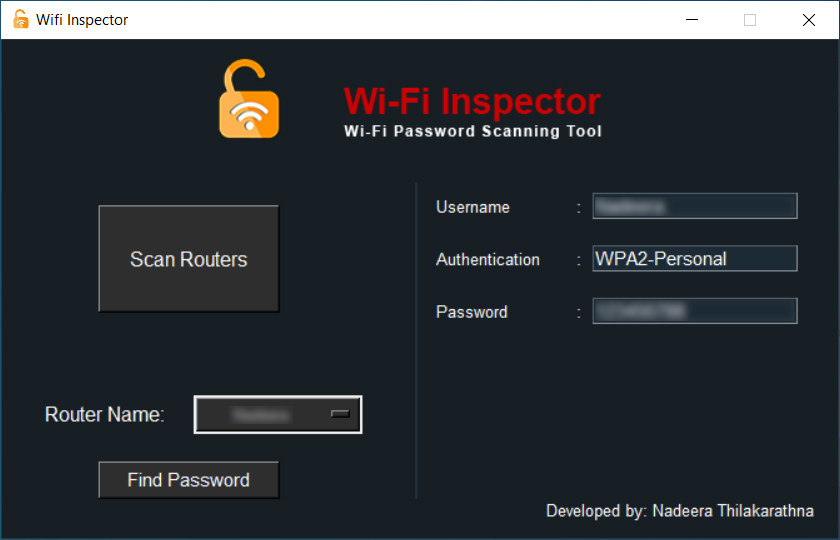

# Wi-Fi Inspector
### **WiFi Password Scanning Tool**

Wi-Fi Inspector is a user-friendly WiFi password scanner designed for Windows computers. This tool allows users to easily scan and retrieve WiFi passwords saved on their Windows systems.

## License 
This project distributed under the GPL V2 license. When you make changes the source code, you must give the permission for owner and give the credits to the authorized owner.
